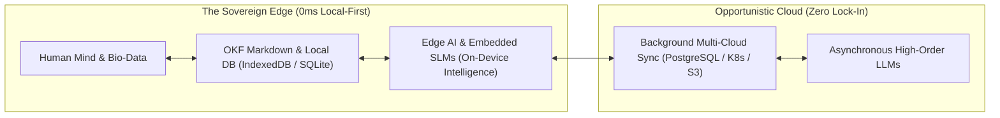

# Hi, I'm Olivier Lépine (`@crapougnax`) 👋
### Cloud-Native Architect • Quantified Self & Longevity Advocate • Space & Robotics Explorer

<p align="left">
  <a href="https://linkedin.com/in/crapougnax"></a>
  <a href="https://twitter.com/crapougnax"></a>
  <a href="https://gist.github.com/crapougnax/47971b85aa73dd702f4372a89858111c"></a>
  
</p>

> *Coder, Maker, Entrepreneur, Epicurean Taoist, Quantified & Sovereign ❤️*  
> 📍 **EU-Africa-Gulf-India Corridor or Remote** | 💼 **Available for Strategic Advisory, Fractional CTO & Frontier Architecture**

Founder of **[@bradtech](https://github.com/bradtech)** (DeepTech Agronomy & Industrial IoT) and **[@Quatrain](https://github.com/Quatrain)** (Enterprise Master Data Management & Finite State Machines). Creator of the **[Tycho](https://github.com/tycho-ops)** open-source autonomous infrastructure ecosystem.

---

## 🧠 The Modaka Vision: Sovereign Intelligence, Edge AI & Local-First

I believe the future of artificial intelligence must not be centralized into monolithic cloud silos. Real intelligence is **sovereign, frugal, and edge-native**.



### 1. Local-First Architecture (0ms Latency & True Ownership)
Data must belong irrevocably to the user or tenant. In **[Modaka](https://github.com/crapougnax/modaka)**, applications perform 0ms local reads and writes via client-side databases (IndexedDB, SQLite, local disk) and synchronize opportunistically in the background. If the network drops, your second brain and tools work without interruption.

### 2. Open Knowledge Format (OKF v0.1)
No proprietary database lock-in. OKF stores knowledge as flat, human-readable Markdown bounded by structured YAML headers. It provides deterministic semantic structures that both human beings and autonomous AI agents can query through progressive disclosure.

### 3. Edge AI & Frugal Computing
Pushing inference directly to user devices, robotics controllers, and IoT gateways using Small Language Models (SLMs) and on-device neural embeddings. Heavy cloud models are reserved strictly for asynchronous reasoning, guaranteeing data privacy, minimal energy footprint, and instantaneous responsiveness.

### 4. Deterministic Reality Meets Probabilistic AI
LLMs generate possibilities, but physical reality demands determinism. By coupling AI agents with strict Finite State Machines (FSM) and Domain-Driven Design (DDD), we build mission-critical systems that are intelligent yet provably reliable for industrial IoT, robotics, and medical telemetry.

---

## 🔭 Frontier Domains & Focus Areas

### 🧬 1. Quantified Self, Health & Longevity
Passionate advocate for personal health metrics sovereignty, biological telemetry, and longevity science. Building local-first, privacy-preserving tools to model, track, and optimize physiological well-being without vendor lock-in.

### 🛰️ 2. Space Technologies & Autonomous Robotics
Exploring the new frontier: mission-critical edge computing, real-time robotics firmware (C++ / PlatformIO / RTOS), satellite and terrestrial LoRaWAN telemetry, and fail-safe state machines designed for extreme, high-reliability environments.

### ☁️ 3. Cloud-Native & Autonomous Infrastructure
Designing zero-friction, sovereign cloud systems: Kubernetes ARM64/AMD64 clusters, declarative GitOps with ArgoCD, automated ACME/Let's Encrypt TLS orchestration, and rootless Podman container environments ([Tycho](https://github.com/tycho-ops)).

---

## 🌐 Featured Ecosystems & Open-Source Highlights

| Ecosystem / Project | Frontier & Domain | Core Stack |
| :--- | :--- | :--- |
| 🚀 **[Tycho k8s-iac](https://github.com/crapougnax/k8s-iac)** | Multi-Cloud Kubernetes IaC, 1-Click TLS & Declarative GitOps | `Terraform` • `Kubernetes` • `Traefik v3` • `ArgoCD` |
| 🧠 **[Modaka](https://github.com/crapougnax/modaka)** | Sovereign Data Brain, Edge-First PKM & AI Semantic Networks | `TypeScript` • `Bun` • `OKF v0.1` • `Edge AI` |
| 🤖 **[BradTech / BradOS](https://github.com/bradtech-oss)** | Industrial Edge Telemetry, Robotics Firmware & ChirpStack v4 | `C++ / PlatformIO` • `LoRa Basics™ Station` • `PostgreSQL` |
| ⚡ **[Tycho CLI](https://github.com/tycho-ops/tycho)** | Autonomous Rootless Host & Container Orchestrator | `Rootless Podman` • `Bash / POSIX` • `Systemd` |
| 🏗️ **[Quatrain Core](https://github.com/Quatrain)** | Universal Master Data Management & Reality State Machines | `TypeScript` • `DDD` • `State Machines` • `AGPL-v3` |

---

## 🛠️ Core Engineering & Architectural Stack

```text
Languages       : TypeScript (Strict/No Any), Modern C++ (Embedded/Firmware/Robotics), Python, Bash/POSIX
Hardware & IoT  : ESP32 / ARM Microcontrollers, PlatformIO, LoRaWAN (ChirpStack/Basics Station), Sensor Networks
Edge & AI       : Local-First (IndexedDB/SQLite), Small Language Models (SLMs), On-Device Embeddings, OKF v0.1
Cloud & Infra   : Kubernetes (ARM64 & AMD64), Terraform, Traefik v3, Scaleway, AWS, Podman Rootless
Architecture    : Domain-Driven Design (DDD), Finite State Machines (FSM), 15-Year Horizon Maintainability
```

---

## 📜 Engineering Philosophy & LLM Agent Protocol

All public and enterprise architectures in my portfolio adhere to strict, long-term engineering standards:
- 🛡️ **[LLM Agent Development Principles & GitFlow Protocol (AGENTS.md)](https://gist.github.com/crapougnax/47971b85aa73dd702f4372a89858111c)**
- 🔒 **Zero Hardcoded Secrets & Fail-Fast Infrastructure-as-Code**
- 🧪 **Zero Untested Code & Test-Driven Development (TDD)**
- 🌍 **15-Year Horizon & Clean Modular Architecture**

---

## 📫 Connect & Collaborate

- 💼 **LinkedIn**: [linkedin.com/in/crapougnax](https://www.linkedin.com/in/crapougnax/)
- 🐦 **Twitter / X**: [@crapougnax](https://twitter.com/crapougnax)
- 🏢 **Organizations**: [@tycho-ops](https://github.com/tycho-ops) • [@bradtech](https://github.com/bradtech) • [@Quatrain](https://github.com/Quatrain)
